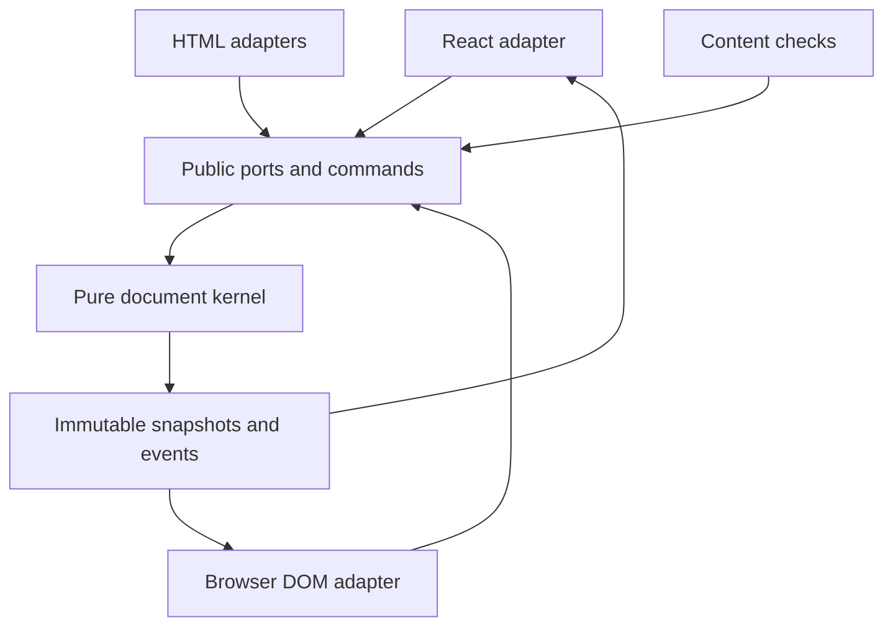
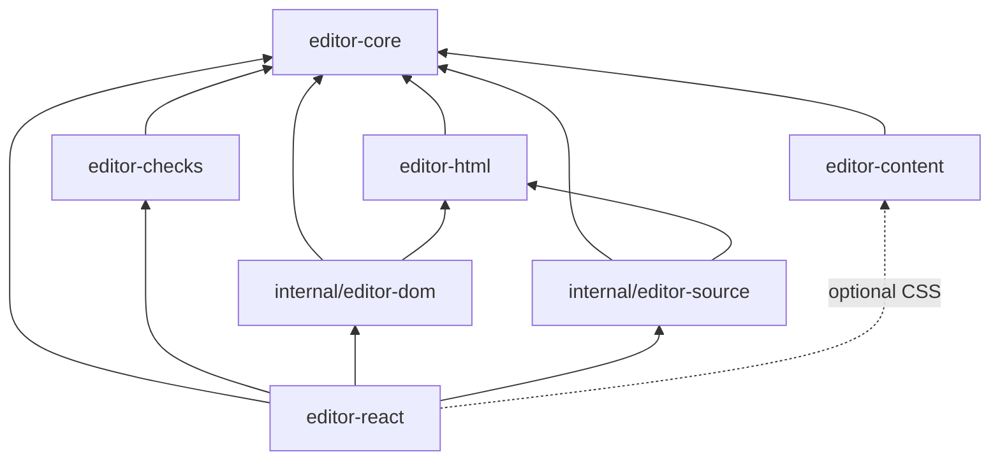
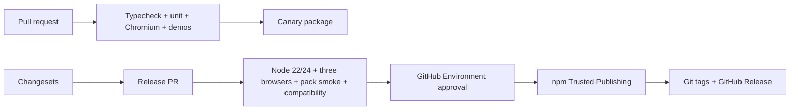

# Architecture Spine — Text Editor Engine

## Design Paradigm

ใช้ **Hexagonal Architecture with Functional Core / Imperative Shell**: `editor-core` เป็น pure TypeScript document kernel ส่วน DOM, HTML, React, Next.js และ npm release เป็น adapters รอบ ports ที่ core เป็นเจ้าของ



## Invariants & Rules

### AD-1 — เขียน editing kernel เอง [ADOPTED]

- **Binds:** CAP-1, CAP-2, CAP-3, CAP-7, CAP-9, CAP-11
- **Prevents:** third-party editor model, transaction หรือ plugin type กลายเป็น public contract
- **Rule:** ทีมเป็นเจ้าของ document model, operations, transactions, selection mapping, history, commands, input, composition และ clipboard behavior; ห้ามใช้ third-party editor kernel

### AD-2 — Core เป็น pure functional state machine [ADOPTED]

- **Binds:** CAP-3, CAP-4, CAP-7, CAP-9
- **Prevents:** DOM หรือ React lifecycle เปลี่ยน state โดยข้าม transaction
- **Rule:** ทุก document mutation ต้องเป็น validated atomic transaction จาก command; core ห้าม import DOM, React, Node API, sanitizer หรือ persistence code

### AD-3 — Engine เป็นเจ้าของ state [ADOPTED]

- **Binds:** CAP-4, CAP-7, CAP-9
- **Prevents:** typing และ IME correctness ขึ้นกับ React render timing
- **Rule:** `EditorEngine` เป็นเจ้าของ document, selection, history, revision และ saved baseline พร้อม `dispatch`, `subscribe` และ immutable `getSnapshot`; React อ่าน UI snapshot ผ่าน `useSyncExternalStore`; dirty state กลับเป็น clean ได้เฉพาะเมื่อ host ยืนยัน normalized HTML snapshot เป็น baseline ใหม่

### AD-4 — Dependency direction บังคับจาก adapters เข้าหา core

- **Binds:** all
- **Prevents:** package cycles และ framework concern รั่วเข้า kernel
- **Rule:** dependency ต้องเป็นไปตามกราฟนี้เท่านั้น; public package ห้าม import internal package จาก published output



### AD-5 — HTML ผ่าน normalized AST และ canonical serializer [ADOPTED]

- **Binds:** CAP-1, CAP-5, CAP-9, CAP-11
- **Prevents:** persisted HTML ต่างกันตาม browser หรือ `innerHTML`
- **Rule:** browser ใช้ native `DOMParser`/`template`, server ใช้ parse5 แล้วแปลงเข้า normalized HTML AST เดียวกัน; persisted output ต้องมาจาก pure deterministic serializer ของเราและห้ามใช้ `innerHTML`; safe unsupported subtree ต้องเก็บเป็น lossless read-only `RawHtmlNode` และ canonical normalization ใช้เฉพาะ structured content ที่รองรับ

### AD-6 — Security policy เดียว หลาย sanitizer adapters [ADOPTED]

- **Binds:** CAP-1, CAP-5, CAP-8, CAP-11
- **Prevents:** browser กับ server อนุญาต tag, attribute, URL หรือ token class ไม่ตรงกัน
- **Rule:** `editor-html` เป็นเจ้าของ pure authoritative `evaluateContentPolicy(ast, canonicalPolicy)` และ stable policy fingerprint โดย canonicalization ต้องเติม default และเรียง set/map ก่อน hash; restricted profile ห้าม script, style, event attributes, SVG/MathML, unsafe schemes และ media embeds โดย default; browser/server sanitizer adapters compile จาก policy เดียวกันและ output ต้อง parse กลับแล้วผ่าน evaluator ก่อนถือว่า trusted; fixtures เทียบ verdict และ normalized safe AST ไม่ใช่ byte output; Source Apply ใช้ evaluator แล้ว reject ทั้ง operation เมื่อไม่ผ่าน ห้าม sanitize หรือแก้ source เงียบ ๆ

### AD-7 — React/Next.js เป็น adapters ไม่ใช่ kernel dependencies [ADOPTED]

- **Binds:** CAP-4, CAP-5, CAP-6
- **Prevents:** core ใช้นอก React ไม่ได้ หรือ Next.js runtime ติดไปกับ npm package
- **Rule:** เฉพาะ `editor-react` มี React peer dependency `>=18.2 <20`; Next.js อยู่ใน private demo เท่านั้น; browser entry point ต้องมี client boundary และ server/public rendering ห้ามโหลด editor runtime

### AD-8 — UI เป็น headless และ styles แยกตามหน้าที่ [ADOPTED]

- **Binds:** CAP-2, CAP-5, CAP-6, CAP-10
- **Prevents:** consumer ต้อง override component library หรือ editor UI class กลายเป็น persisted content contract
- **Rule:** `editor-react` ให้ hooks, context, accessible primitives และ optional `editor.css` โดยไม่พึ่ง visual component framework; `editor-content/content.css` เป็น versioned public contract แยกต่างหาก; modal เป็นของ consumer

### AD-9 — Public packages แยก version อย่างอิสระ [ADOPTED]

- **Binds:** all public packages
- **Prevents:** package ที่ไม่เปลี่ยนถูก bump โดยไม่จำเป็น และ dependency ranges ใช้ร่วมกันไม่ได้
- **Rule:** Changesets กำหนด SemVer ต่อ package; dependent package ต้อง bump เมื่อ dependency range เดิมไม่รองรับ; ทุก release ต้องสร้าง tested compatibility cohort manifest ของชื่อ+เวอร์ชัน public packages; HTML contract, persisted classes และ plugin API เป็น compatibility surface

### AD-10 — Internal packages ห้าม publish [ADOPTED]

- **Binds:** editor-dom, editor-source, demos
- **Prevents:** consumer ผูกกับ implementation detail หรือ accidental npm publication
- **Rule:** `internal/editor-dom`, `internal/editor-source` และ `apps/*` ต้องมี `private: true`; code ภายในที่ `editor-react` ต้องใช้ต้องถูก bundle และห้ามปรากฏเป็น unresolved private runtime dependency ใน packed tarball

### AD-11 — Browser-owned behavior ต้องทดสอบใน browser จริง [ADOPTED]

- **Binds:** CAP-4, CAP-6, CAP-7, CAP-10
- **Prevents:** jsdom tests ผ่านแต่ selection, clipboard, composition หรือ accessibility behavior ใช้งานจริงเสีย
- **Rule:** pure logic ใช้ Vitest บน Node; DOM, React และ integration behavior ใช้ Playwright; PR gate ใช้ Chromium และ release gate ใช้ Chromium, Firefox, WebKit พร้อม manual Thai IME checklist

### AD-12 — Demo เป็น executable integration contracts [ADOPTED]

- **Binds:** CAP-3, CAP-4, CAP-5, CAP-6, CAP-7, CAP-10, CAP-11, CAP-12
- **Prevents:** workspace linking ปิดบัง package export, peer dependency หรือ Next.js boundary defects
- **Rule:** `react-playground` ครอบคลุม authoring/plugin/source/check scenarios; `next-demo` ครอบคลุม client editor, CMS preview และ server-rendered public page; release smoke tests ต้องติดตั้ง packed tarballs หรือ canary packages

### AD-13 — Public release มี approval และ provenance [ADOPTED]

- **Binds:** all public packages
- **Prevents:** unreviewed release และ long-lived npm write credentials
- **Rule:** version workflow ใช้ stable `changesets/action@v1` กับ Changesets CLI 2.x เพื่อสร้าง release PR เท่านั้น; publish workflow แยกสิทธิ์ รันบน GitHub-hosted Node 24, รอ GitHub Environment approval แล้วเรียก Changesets/npm ผ่าน OIDC Trusted Publishing ก่อน push git tags และสร้าง GitHub Release; public repository และ npm trusted-publisher mapping เป็น precondition; public packages ใช้ MIT License

### AD-14 — Release channels แยกการทดลองออกจาก stable [ADOPTED]

- **Binds:** all public packages
- **Prevents:** package ที่ยังไม่ผ่าน consumer validation ถูกติดตั้งผ่าน `latest`
- **Rule:** PR ใช้ canary/snapshot, release candidate ใช้ `beta`, stable ใช้ `latest`; ก่อน 1.0 breaking changesต้องมี Changeset และ migration note และตั้งแต่ 1.0 ต้องใช้ SemVer เคร่งครัด

### AD-15 — Runtime compatibility เป็น release contract [ADOPTED]

- **Binds:** CAP-4, CAP-5, CAP-7
- **Prevents:** dependency upgrade ยกเลิก consumer environment โดยไม่มี major release
- **Rule:** editor รองรับ Chrome/Edge, Firefox และ Safari stable บน desktop; mobile รับประกันเฉพาะ rendered content; repository toolchain และ Node-capable packages รองรับ Node `>=22.18.0` รวม Node 24; การยกเลิก Node 22, React 18 หรือ desktop browser family ต้องเป็น major release

### AD-16 — Source mode เป็น isolated authorized transaction [ADOPTED]

- **Binds:** CAP-11
- **Prevents:** source ที่ไม่ผ่าน policy เปลี่ยน document บางส่วน หรือผู้ใช้ที่ไม่ได้รับสิทธิ์ข้าม visual constraints
- **Rule:** host ต้องอนุญาต Source mode; editor แก้ isolated working copy; Cancel ห้ามเปลี่ยน state; Apply ต้องผ่าน syntax/policy/parse ทั้งหมดก่อน commit เป็น transaction เดียวที่ undo ได้; failure ห้ามเปลี่ยน document/history และต้องคง working copy, cursor กับ diagnostic ให้ผู้ใช้แก้ต่อ

### AD-17 — Content checks ผูกกับ revision [ADOPTED]

- **Binds:** CAP-10, CAP-12
- **Prevents:** issue หรือ automatic fix ถูกนำไปใช้กับ document snapshot คนละรุ่น
- **Rule:** checker คืน issue พร้อม rule ID, standard reference, severity, node location และ source revision; adapter ต้องทิ้งหรือ rerun stale result; optional fix ต้อง dispatch command กับ target/revision ที่ยังใช้ได้เท่านั้น

### AD-18 — Cross-package contracts มีเจ้าของเดียว

- **Binds:** all
- **Prevents:** แต่ละ package นิยาม position, transaction, snapshot, event, plugin port หรือ policy shape ที่หน้าตาคล้ายกันแต่ใช้ร่วมกันไม่ได้
- **Rule:** `editor-core` เป็นเจ้าของและ export document nodes, node IDs, model positions, selections, operations, transactions, revisions, snapshots, events, commands, plugin ports และ token-registry interface; `editor-html` เป็นเจ้าของ normalized HTML AST, diagnostics และ `ContentPolicy`; package อื่นต้อง import type เหล่านี้จาก public export ของเจ้าของและห้ามประกาศสำเนา; plugin registry compile ตอนสร้าง engine, reject duplicate node/mark/command/rule IDs, กำหนด explicit integer priority ให้ parse rule ที่ overlap และ reject tie, ต้องมี serializer เพียงหนึ่ง ruleต่อ node type, เรียง normalization ด้วย priority แล้ว plugin name/rule ID และทำซ้ำถึง fixed point โดย repeated document digest หรือเกิน pass limit ต้อง reject transaction ด้วย `NORMALIZATION_DID_NOT_CONVERGE`

### AD-19 — Selection และ revision ordering เป็น deterministic contract

- **Binds:** CAP-4, CAP-6, CAP-7, CAP-9, CAP-10, CAP-12
- **Prevents:** bookmark, dirty acknowledgement, checker result หรือ subscriber event ถูกนำไปใช้กับ state คนละ revision
- **Rule:** model position ใช้ `{nodeId, offset, affinity}` และ range ใช้ anchor/head; text offset นับ UTF-16 code units, container offset นับ child index และ affinity เป็น `forward|backward`; เมื่อ insert ตรง boundary ตำแหน่ง forward ย้ายไปหลัง content ใหม่และ backward คงอยู่ก่อน content ใหม่, ส่วนตำแหน่งที่ถูก delete map ไป surviving boundary ใกล้สุดในทิศ affinity; node ID ไม่ซ้ำภายใน document lineage, คงเดิมสำหรับ node ที่ transaction map ต่อได้, สร้างใหม่เมื่อ import และไม่ serialize; ทุก committed transaction เพิ่ม revision แบบ monotonic ครั้งเดียว, map positions ผ่าน operation map แล้ว publish snapshot synchronously ตาม commit order; saved acknowledgement และ async result ต้องระบุ source revision กับ normalized HTML digest และถูกปฏิเสธเมื่อไม่ตรง

### AD-20 — DOM adapter เป็นเจ้าของ browser mutation path เดียว

- **Binds:** CAP-4, CAP-7
- **Prevents:** browser, React และ plugins แก้ editable DOM แข่งขันกันระหว่าง input/composition
- **Rule:** `internal/editor-dom` เป็นผู้รับ `beforeinput`, keyboard, clipboard, composition, selection และ mutation events เพียงรายเดียวและแปลงเป็น core commands; React/plugins ห้ามแก้ editable subtree; ระหว่าง composition adapter เก็บ transient buffer และห้าม commit `beforeinput` ซ้ำ, `compositionend` dispatch transaction เดียว; blur, non-composition input ใหม่ หรือ editor disposal ต้องเรียก synchronous `finalizeComposition` ที่ commit valid buffer ครั้งเดียว หรือเมื่อ invalid ให้ cancel, restore committed DOM และ emit diagnostic โดยห้ามใช้ timeout เป็น correctness path; clipboard read/parse อยู่ใน adapter แต่ document insertion ต้องผ่าน `insertSlice` command

### AD-21 — Persisted HTML/CSS rollout ต้อง backward compatible

- **Binds:** CAP-1, CAP-2, CAP-5, CAP-9
- **Prevents:** CMS สร้าง class/markup ที่เว็บไซต์ production ยัง render หรือ sanitize ไม่ได้
- **Rule:** compatibility cohort ระบุ HTML contract และ content stylesheet version; deploy stylesheet/sanitizer support ก่อนเปิด serializer output ใหม่; token เดิมมี alias จน migrate เสร็จ; rollback ห้ามสร้าง HTML contract ที่เก่ากว่า persisted content ที่มีอยู่

### AD-22 — Multi-package promotion ต้อง recoverable

- **Binds:** all public packages
- **Prevents:** independent publish สำเร็จเพียงบาง package แล้ว `latest` ชี้ไปยังชุดที่ใช้ร่วมกันไม่ได้
- **Rule:** publish immutable versions ของทั้ง release cohort ใต้ temporary dist-tag ก่อน, ติดตั้งและรัน cohort smoke test แล้วจึงเลื่อน `latest`; ทุก stable package ต้องประกาศ dependency/peer range ที่ผ่าน min/max compatibility tests และทุก prerelease ต้อง pin exact internal cohort versions; ทุกลำดับระหว่างการเลื่อน tag ต้อง resolve ได้ตาม ranges; เมื่อ promotion ล้มเหลวให้คืนแต่ละ tag ไปยัง range-compatible last-known-good, deprecate broken versions และ forward-fix ห้าม overwrite หรือพึ่ง unpublish

### AD-23 — Raw HTML เป็น preservation boundary

- **Binds:** CAP-1, CAP-11
- **Prevents:** unsupported safe markup สูญหายหรือ execute ระหว่าง visual editing
- **Rule:** parser จับ topmost unsupported element subtree ที่ผ่าน syntax/policy เป็น opaque `RawHtmlNode` หนึ่งก้อนโดยไม่ parse descendant บางส่วน; เก็บ canonical fragment ที่รักษา element, attribute และ content semantics แม้ไม่รักษา whitespace/attribute order; visual mode แสดง inert read-only representation และห้าม normalize ภายใน; แก้ไขได้ผ่าน authorized Source mode เท่านั้น; active/unsafe subtree ต้องถูก reject

### AD-24 — Token registry และ class prefix เป็น immutable engine configuration

- **Binds:** CAP-2, CAP-5, CAP-6, CAP-9
- **Prevents:** core, serializer และ stylesheet resolve token คนละชุด หรือสร้าง unsafe/ambiguous class
- **Rule:** `editor-core` รับ authoritative registry snapshot ตอนสร้าง engine; `editor-content` ให้ optional preset data/CSS แต่ไม่เป็น runtime authority; `classPrefix` ต้อง immutable และผ่าน safe-prefix grammar; token IDs/aliases ต้องผ่าน safe-slug grammar, unique ข้าม registry และไม่ชนกัน; core, HTML adapters, wrapper, sanitizer และ content CSS ต้องใช้ configuration fingerprint เดียวกัน

### AD-25 — Checker contract มีสถานะและ coverage ที่ตรวจรับได้

- **Binds:** CAP-10, CAP-12
- **Prevents:** UI แสดงผลตรวจไม่ครบเป็นผลผ่าน หรือ rule implementation แยกกันจน coverage ต่างกัน
- **Rule:** check run คืน `{revision, status: complete|cancelled|failed, ruleSetVersion, evaluations, issues}` และแสดงว่า `complete` เท่านั้นจึงสรุปผลได้; ทุก rule evaluation มี `pass|fail|manual-review|not-evaluated` และห้ามนับสามสถานะหลังเป็น pass; opaque `RawHtmlNode` ต้องเป็น manual-review หรือ fail ตาม policy; built-in accessibility rules ครอบคลุม image alt, heading structure, descriptive links, semantic markup, color-only meaning และ contrast พร้อม WCAG 2.2 AA reference โดย contrast ต้องประเมินทุก registered theme/breakpoint variant หรือเป็น not-evaluated; SEO rulesครอบคลุม heading/semantic/image/link/crawlability และห้ามอ้างว่า page metadata ผ่าน

### AD-26 — Image upload และ insertion เป็น host-owned port

- **Binds:** CAP-8
- **Prevents:** upload failure สร้าง partial node หรือ image ที่ไม่มี accessible alternative
- **Rule:** host upload port รับ file/request context และคืน typed asset `{url, alt?, width?, height?}` หรือ typed failure; engine ห้าม insert ก่อน upload สำเร็จและ URL ผ่าน policy; non-decorative image ต้องมี alt text ส่วน decorative image ต้องมี explicit decorative flag และ serialize `alt=""`; cancel/failure ห้ามเปลี่ยน document

### AD-27 — Public runtime identity และ environment exports ต้องไม่กำกวม

- **Binds:** CAP-3, CAP-4, CAP-5, CAP-6
- **Prevents:** bundle มี engine-core หลาย instance หรือ browser ประเมิน server-only dependency
- **Rule:** `editor-react` externalize และประกาศ `editor-core` เป็น peer dependency; stateless public dependenciesใช้ explicit reviewed ranges; `editor-html` root export มีเฉพาะ environment-neutral contracts และเปิด `./browser` กับ `./server` subpaths แยกกัน; browser graph ห้ามมี parse5/sanitize-html และ server graph ห้ามประเมิน DOMPurify/browser globals; packed graph tests บังคับกฎนี้

### AD-28 — Built-in UI และ demos เป็น acceptance contracts

- **Binds:** CAP-4, CAP-5, CAP-6, CAP-10, CAP-11, CAP-12
- **Prevents:** คำว่า headless/customizable/accessibility/demo ถูกตีความต่างกันระหว่างหน่วยพัฒนา
- **Rule:** default toolbar/menu ใช้ semantic controls, documented keyboard navigation, roving focus, visible focus และ disabled/error state ตาม WCAG 2.2 AA; consumer UI รับผิดชอบ accessibility ของส่วนที่แทนเอง; React playground ต้องมี fixture routes สำหรับ built-in formatting, token styling, plugin/modal, source failure/success, checks และ Thai composition harness; Next demo ต้อง assert client-only editor, shared content CSS, sanitized server render และ public route ที่ไม่มี editor/UI CSS client imports

### AD-29 — Host sanitization และ security response เป็น operational boundary

- **Binds:** CAP-1, CAP-5, CAP-11
- **Prevents:** trusted-looking editor output ข้าม server security boundary หรือ known sanitizer issue ค้างใน stable release
- **Rule:** host ต้องใช้ `editor-html/server` sanitize untrusted HTML เมื่อรับ save และทันทีก่อน server render; client validation ไม่ลดข้อกำหนดนี้; repository ต้องเปิด dependency/security advisory monitoring และมีขั้นตอน emergency patch, affected-version npm deprecation, dist-tag correction และ forward-fix โดยไม่ unpublish

## Consistency Conventions

| Concern | Convention |
| --- | --- |
| Package names | ใช้ logical names `editor-core`, `editor-react`, `editor-html`, `editor-checks`, `editor-content`; เติม npm organization scope ก่อน first publish |
| Public imports | Consumer import ได้เฉพาะ `package.json#exports`; deep import ที่ไม่ประกาศถือว่า unsupported |
| Contract ownership | Core contracts import จาก `editor-core`; HTML AST/policy import จาก environment-neutral `editor-html` root; ห้าม duplicate type declarations |
| Mutation | `command → transaction → validated state → snapshot/event`; ห้ามแก้ state หรือ DOM เป็น source of truth โดยตรง |
| Errors | Public failure ใช้ discriminated result/error code; diagnostic HTML มี code, severity, line, column และ node location เมื่อหาได้ |
| HTML | UTF-8 body fragment, normalized attribute ordering/escaping และ semantic round-trip; ไม่สัญญา byte round-trip |
| CSS | Persisted presentation ใช้ stable token classes; UI styles กับ content styles แยก entry point และ namespace |
| Versions | Exact-pin build/test tooling ผ่าน lockfile; runtime/peer dependencies ใช้ reviewed SemVer ranges |

## Stack

Version snapshot ตรวจสอบเมื่อ 2026-09-15; source และ lockfile เป็นเจ้าของ version หลัง scaffold

| Name | Version / policy |
| --- | --- |
| Node.js | build/release 24; support `>=22.18.0` |
| TypeScript | 7.0.2, strict |
| React / React DOM | demo 19.3.0; peer `>=18.2 <20` |
| Next.js | 16.3.5, demo only |
| Vite | 8.3.0, React playground only |
| pnpm | 12.4.2 |
| Turborepo | 2.10.13 |
| tsdown | 0.23.0, ESM-only + `.d.ts` + source maps |
| Vitest | 5.0.1 |
| Playwright Test | 1.63.0 |
| Changesets CLI | 2.31.1; paired with stable `changesets/action@v1.9.0` for version PR only |
| parse5 | 8.0.1, server parser |
| DOMPurify | 3.4.15, browser sanitizer |
| sanitize-html | 2.17.7, server sanitizer |
| publint | 0.3.24 |
| Are the Types Wrong CLI | 0.18.5 |

## Structural Seed

```text
texteditor/
  packages/
    editor-core/       # pure model, selection, transactions, commands, history, plugin ports
    editor-html/       # normalized AST, serializer, browser/server parser and sanitizer entries
    editor-checks/     # accessibility and content SEO rules
    editor-react/      # React adapter, DOM/source bundles, headless/default UI, editor.css
    editor-content/    # optional token preset data and content.css; not runtime authority
  internal/
    editor-dom/        # contenteditable, input, composition, clipboard, DOM mapping
    editor-source/     # source editor state and diagnostics integration
  apps/
    react-playground/  # Vite executable feature contract
    next-demo/         # Next.js executable integration contract
  fixtures/
    html/              # TinyMCE and normalized round-trip fixtures
    security/          # shared sanitizer attack/regression fixtures
    consumers/         # clean React/Next.js tarball-install projects
  tests/
    browser/           # Playwright cross-browser suites
    ime-manual/        # versioned native Thai IME acceptance checklist
  .changeset/
  .github/workflows/
```



## Capability → Architecture Map

| Capability / Area | Lives in | Governed by |
| --- | --- | --- |
| CAP-1, CAP-9 | editor-core, editor-html, fixtures/html | AD-2, AD-3, AD-5, AD-6, AD-19, AD-21, AD-23 |
| CAP-2 | editor-core, editor-react, editor-content | AD-1, AD-8, AD-18, AD-21, AD-24 |
| CAP-3 | editor-core plugin ports, react-playground | AD-1, AD-2, AD-12, AD-18, AD-27 |
| CAP-4 | editor-react | AD-3, AD-7, AD-19, AD-20, AD-27, AD-28 |
| CAP-5 | editor-html, editor-content, next-demo | AD-5, AD-6, AD-7, AD-12, AD-21, AD-24, AD-27, AD-28, AD-29 |
| CAP-6 | editor-react | AD-3, AD-8, AD-24, AD-27, AD-28 |
| CAP-7 | editor-core, internal/editor-dom, tests/browser | AD-1, AD-2, AD-11, AD-15, AD-19, AD-20 |
| CAP-8 | editor-core command port, editor-react integration | AD-2, AD-7, AD-18, AD-26 |
| CAP-10, CAP-12 | editor-checks, editor-react | AD-8, AD-11, AD-17, AD-18, AD-25, AD-28 |
| CAP-11 | internal/editor-source, editor-html | AD-5, AD-6, AD-10, AD-16, AD-23 |
| Release | Changesets, GitHub Actions, npm | AD-9, AD-13, AD-14, AD-15, AD-21, AD-22 |

## Deferred

- **npm organization scope และ final package names:** ปิดก่อน first publish หลังตรวจ ownership และชื่อว่าง; ไม่ขวาง scaffold
- **Image upload wire contract:** ปิดก่อน CAP-8 story เพราะ host application เป็นเจ้าของ transport/authentication
- **Legacy TinyMCE inline-style mapping:** ปิดหลังสำรวจ production fixtures และก่อน migration story
- **Block-background semantics:** ปิดก่อน CAP-2 background story
- **Allowed iframe/audio/video hosts และ attributes:** ปิดก่อนเปิด media policy; default คือไม่อนุญาต
- **Mobile editing:** เปิดพิจารณาหลัง desktop suite เสถียรและมี dedicated touch/virtual-keyboard stories
- **Lint/format tool และ dependency-update bot:** เลือกตอน scaffold; ต้องให้คำสั่ง CI deterministic แต่ไม่เป็น runtime invariant
- **GitHub Environment reviewer availability:** ตรวจ plan/repository visibility ตอน scaffold; หาก required reviewers ใช้ไม่ได้ ให้ใช้ npm staged publishing approval แทนโดยคง human gate
